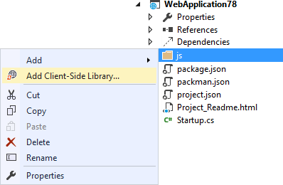
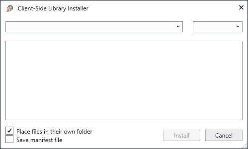
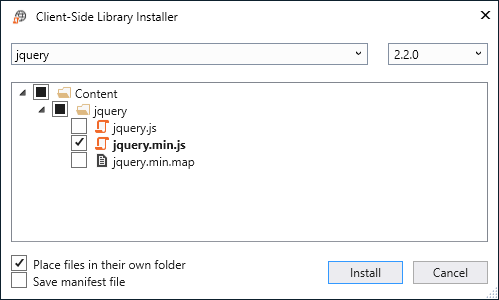
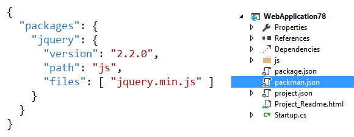
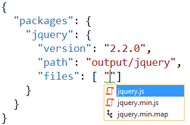
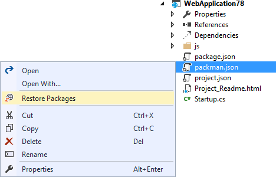

# Client-Side Library Installer

[](https://ci.appveyor.com/project/madskristensen/packman)

Download the extension at the
[VS Gallery](https://visualstudiogallery.msdn.microsoft.com/4cd5e0e0-2c38-426b-9f43-1d3688cc8be1)
or get the
[nightly build](http://vsixgallery.com/extension/ce753d0f-f511-4b2b-93de-5cc50145dca6/).

See the
[changelog](CHANGELOG.md)
for changes and roadmap.

---------------------------------------------------

A simple solution to installing JavaScript and CSS libraries
into any project. It uses well established global content
delivery networks that hosts thousands of the most popular
libraries.

Because it uses these content delivery networks as
data source, it allows the user to be in total control
over where to install the packages and what files
to install. The user is in complete control of what 
is added to the project.

## Reasons for using this extension
1. For apps not currently using another package manager
2. For projects where you think Bower and npm are overkill
3. For developers that don't want to use Bower or npm
4. For developers that values simplicity in their tools
5. For using custom or private packages/files
6. For ASP.NET Core apps where NuGet can't install content packages

## Reasons for NOT using it
1. Developer/team likes using Bower and/or npm
2. For apps that uses WebPack or Browserify for module loading/bundling
3. For app types where NuGet works just fine

## Features

- Fastest library installer in the world
  - Libraries installs take just milliseconds
- Contains all the relevant client-side libraries
- Always up-to-date with the latest versions
- Can install libraries into any folder
- Only installs the files you need and nothing else
  - Unlike Bower and npm that installs many extra files
- Great Visual Studio integration
- Is based on existing CDN infrastructure
  - Uses [JsDelivr](http://www.jsdelivr.com/) and [Cdnjs](https://cdnjs.com/) as package catalogs
- Work in all Visual Studio projects types
  - Including ASP.NET, Cordova and Universal Windows Apps

### Installing a library
Right-click any folder in your projet and hit
**Add Client-Side Library...**



This brings up the package installer dialog.



You can now search for the thousands of available
packages. 

When you find the right package, the
version dropdown populates to the latest stable version
of the package.



The tree view shows what files are available and will
preselect the file(s) that it thinks you may want.

### Place files in their own folder
By checking this checkbox, a folder with the same
name as the package will be created and all the package
files will be added to that folder.

This option is checked by default.

### The manifest files
A main difference between this extension and package
managers is that a manifest file is not needed at all
in order to install packages.

NuGet uses _packages.config_, Bower uses _bower.json_ etc.

This extension uses an optional file called _packman.json_.

If you don't check the **Save manifest file** checkbox,
it will just add the library files to the selected
folder, but not keep a record of it anywhere. This is
essentially the same as going to a library's website
and manually downloading the files and copying them into
your project.

It's important to note that library restore will not be
possible without a manifest file.

The format of the manifest file is simple and easy to
understand.



If you want to modify the manifest file manually, full
Intellisense is provided for package names, versions
and file names.



You only get Intellisense for file names if the _version_
property exist and has an accurate value.

### Custom URLs
You can create custom libraries that will download files
at any URL you specify. To do that, open `packman.json`
and add a custom entry like so:

```json
"my-custom-package":{
  "path": "output/custom",
  "urls": [ 
    "http://example.com/file.js",
    "http://example.com/file.min.js"
  ]
}
```

Then simply restore the libraries to download and add the
files to your project.

### Restoring packages
It's very easy to restore libraries. Just right-click the
package.json manifest file and select
**Restore packages**.



This will hydrate your project with the files from all
the libraries listed in packman.json.

Library restore will also happen every time you save
packman.json. This behavior can be disabled in the
options dialog.

## Options
An options page is available in the Visual Studio 
options dialog.


From here you can set various settings including which
provider to use - 
[JsDelivr](http://www.jsdelivr.com/)
or
[Cdnjs](https://cdnjs.com/).

## License
[Apache 2.0](LICENSE)